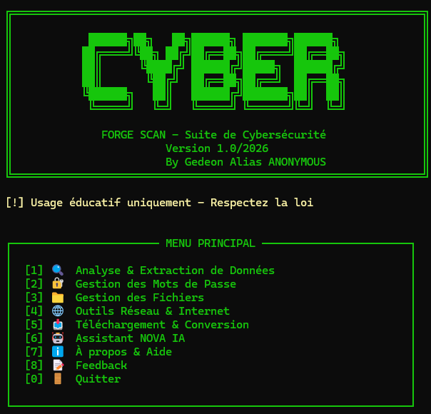
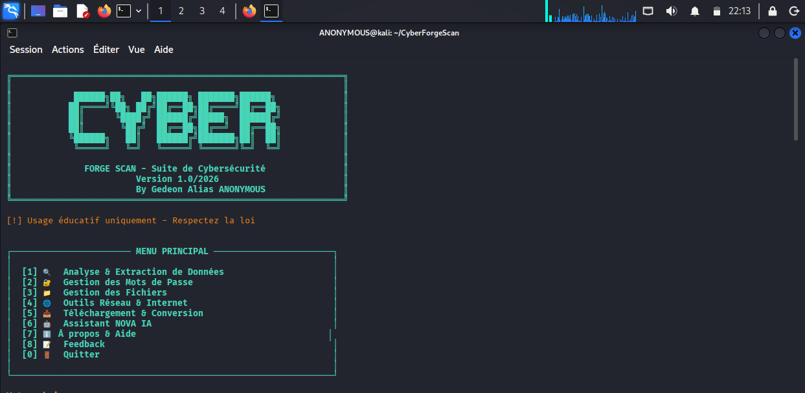
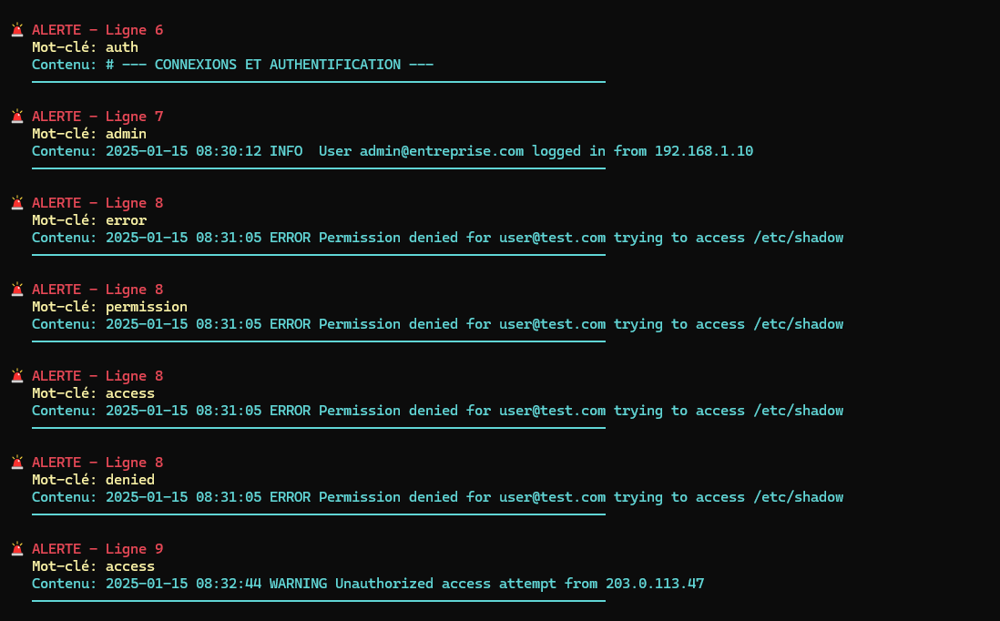
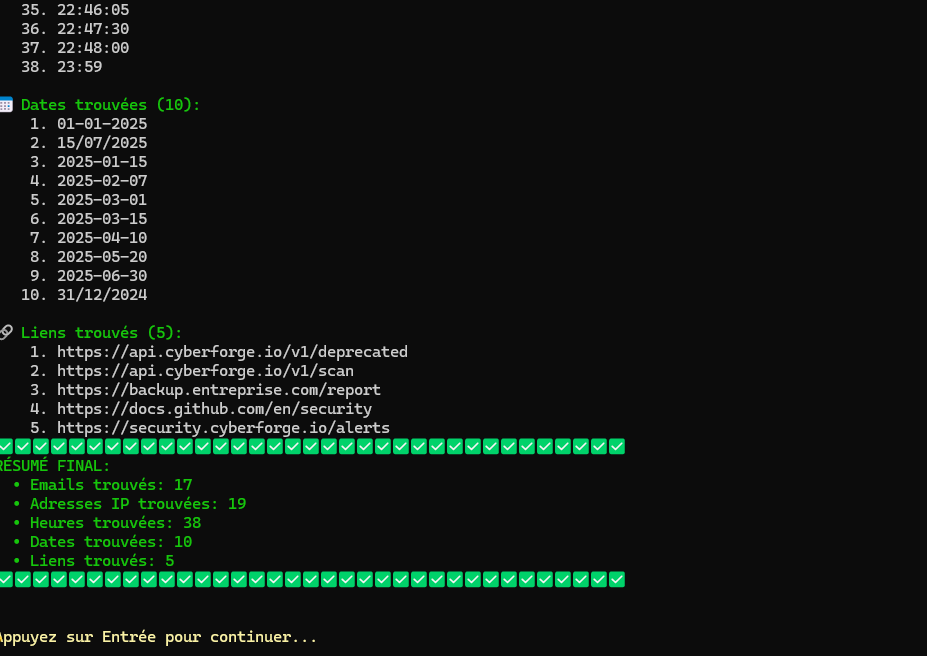
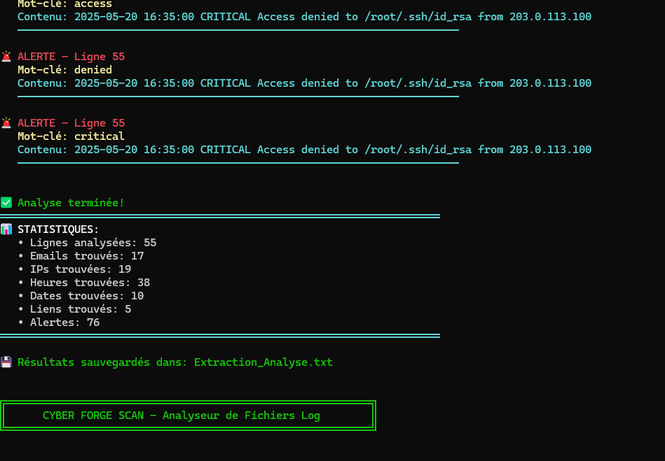

# 🔐 CYBER FORGE SCAN

<p align="center">
  
</p>

<p align="center">
  
  
  
  
  
</p>

---

## 📋 Table des Matières

- [Screenshots](#-screenshots)
- [Vue d'ensemble](#-vue-densemble)
- [Fonctionnalités](#-fonctionnalités)
- [Installation](#-installation)
- [Utilisation](#-utilisation)
- [Modules](#-modules)
- [Prérequis](#-prérequis)
- [Configuration](#-configuration)
- [Exemples](#-exemples)
- [Avertissements](#-avertissements)
- [Dépannage](#-dépannage)
- [Contribution](#-contribution)
- [Licence](#-licence)
- [Contact](#-contact--support)

---

## 📸 Screenshots

### 🖥️ Menu Principal

<p align="center">
  
</p>
<p align="center">

</p>

> Interface principale de CYBER FORGE SCAN sur Kali Linux — bannière ASCII et menu interactif coloré.

---

### 🚨 Analyse & Détection d'Alertes de Sécurité

<p align="center">
  
</p>

> Détection en temps réel des mots-clés sensibles dans un fichier log : `auth`, `admin`, `error`, `permission`, `denied`, `critical`...

---

### 📊 Résultats d'Extraction Complets

<p align="center">
  
  
</p>

> Extraction complète : **17 emails**, **19 adresses IP**, **38 heures**, **10 dates**, **5 liens** — résultats sauvegardés automatiquement dans `Extraction_Analyse.txt`.

---

## 🎯 Vue d'ensemble

**CYBER FORGE SCAN** est une suite d'outils de cybersécurité développée en Python, conçue pour l'apprentissage et la sensibilisation à la sécurité informatique. Elle regroupe 9 modules spécialisés couvrant l'analyse de fichiers, la gestion des mots de passe, les outils réseau et bien plus.

### Pourquoi utiliser CYBER FORGE SCAN ?

✅ **Interface intuitive** - Menu interactif avec messages clairs et colorés  
✅ **Modulaire** - Chaque outil fonctionne indépendamment  
✅ **Pédagogique** - Idéal pour apprendre la cybersécurité  
✅ **Multiplateforme** - Windows, Linux, macOS  
✅ **Open Source** - Code source disponible et modifiable

---

## 🚀 Fonctionnalités

### 1️⃣ Analyse & Extraction de Données

- 📧 **Extraction d'emails** depuis fichiers logs
- 🌐 **Extraction d'adresses IP**
- 📅 **Détection de dates et heures**
- ⚠️ **Détection de mots-clés sensibles** (error, admin, denied, etc.)
- 📊 **Analyse de fichiers système**
- 💾 **Identification des gros fichiers**

### 2️⃣ Gestion des Mots de Passe

- 🔐 **Génération de mots de passe sécurisés**
  - Personnalisés (avec votre base)
  - Aléatoires (haute sécurité)
- 🧪 **Test de robustesse** des mots de passe
- 📝 **Sauvegarde automatique** dans un fichier
- ⚡ **Démonstration bruteforce** (éducatif)

### 3️⃣ Gestion des Fichiers

- 🏷️ **Renommage en masse** de fichiers
- 📂 **Organisation automatique** par extension
- 📄 **Conversion DOCX/TXT → PDF**
- 🔄 **Conversion en lot** (dossiers entiers)

### 4️⃣ Outils Réseau & Internet

- 📡 **Test de vitesse Internet** (download/upload/ping)
- 📊 **Comparaison de tests** multiples
- 🔑 **Extraction des mots de passe WiFi** (Windows uniquement)

### 5️⃣ Téléchargement & Conversion

- 🎥 **Téléchargement YouTube** (vidéo/audio)
- 📹 **Enregistrement d'écran** (configurable)
- ℹ️ **Récupération d'infos vidéo** sans télécharger

### 6️⃣ Assistant IA

- 🤖 **ChatBot local** (Ollama)
- 💬 **Support conversationnel**
- 📚 **Aide contextuelle** sur les outils

---

## 💻 Installation

### Option 1: Installation Rapide

```bash
# Cloner le projet
git clone https://github.com/GedeonTch/CyberForgeScan.git
cd cyberForgeScan
python3 -m venv venv
source venv/bin/activate

# Installer les dépendances
pip install -r requirements.txt

# Lancer le programme
python main.py
```

### Option 2: Installation Manuelle

```bash
# Télécharger le ZIP depuis GitHub
# Extraire les fichiers
cd CyberForgeScan

# Installer les modules Python requis
pip install fpdf2 python-docx speedtest-cli yt-dlp opencv-python numpy pyautogui Pillow requests

# Lancer
python CyberForceScanMain.py
```

---

## 📦 Prérequis

### Système

- **Python** 3.7 ou supérieur
- **Système d'exploitation**: Windows 10/11, Linux, macOS

### Modules Python (installés automatiquement)

| Module          | Usage                  | Installation |
| --------------- | ---------------------- | ------------ |
| `fpdf2`         | Création de PDF        | Automatique  |
| `python-docx`   | Lecture DOCX           | Automatique  |
| `speedtest-cli` | Test vitesse Internet  | Automatique  |
| `yt-dlp`        | Téléchargement YouTube | Automatique  |
| `opencv-python` | Enregistrement écran   | Automatique  |
| `pyautogui`     | Capture d'écran        | Automatique  |
| `requests`      | Requêtes HTTP          | Automatique  |
| `Pillow`        | Traitement d'images    | Automatique  |
| `numpy`         | Calculs matriciels     | Automatique  |

### Optionnel

- **Ollama** (pour l'assistant IA)
  - Installation: https://ollama.ai
  - Modèle recommandé: `phi3:mini`

---

## 🎮 Utilisation

### Démarrage

```bash
python CyberForceScanMain.py
```

### Navigation dans les menus

Le programme affiche un menu principal avec 7 catégories :

```
┌─────────────────────── MENU PRINCIPAL ───────────────────────┐
│                                                              │
│  [1] 🔍 Analyse & Extraction de Données                     │
│  [2] 🔐 Gestion des Mots de Passe                           │
│  [3] 📁 Gestion des Fichiers                                │
│  [4] 🌐 Outils Réseau & Internet                            │
│  [5] 📥 Téléchargement & Conversion                         │
│  [6] 🤖 Assistant IA                                        │
│  [7] ℹ️  À propos & Aide                                    │
│  [0] 🚪 Quitter                                             │
│                                                              │
└──────────────────────────────────────────────────────────────┘
```

Tapez le numéro correspondant et appuyez sur **Entrée**.

---

## 📚 Modules

### Module 1: Analyse.py

**Analyse de fichiers logs**

Extrait des données structurées depuis des fichiers texte ou logs :

- Emails (regex avancée)
- Adresses IP (IPv4)
- Dates et heures
- Mots-clés sensibles
- Liens

**Exemple d'utilisation:**

```python
from Analyse import analyser_fichier_log

emails, ips, times, dates = analyser_fichier_log("server.log")
print(f"Emails trouvés: {emails}")
```

**Formats supportés:** `.txt`, `.log`

---

### Module 2: PassWordGenerate.py

**Génération et test de mots de passe**

**Fonctions principales:**

- `generatePswdWithInfo(base, length)` - Génère 5 mots de passe moyens + 4 forts
- `passWordTest(password)` - Vérifie la robustesse
- `genateStrong_WithoutInfo(length)` - Génération aléatoire pure

**Critères de robustesse:**

- ✅ Longueur ≥ 8 caractères
- ✅ Majuscule en début
- ✅ Au moins un chiffre
- ✅ Au moins un caractère spécial
- ❌ Pas de séquences évidentes (1234, azerty)
- ❌ Pas de mots sensibles (admin, password)

**Exemple:**

```python
from PassWordGenerate import genateStrong_WithoutInfo

password = genateStrong_WithoutInfo(20)
print(password)  # Ex: "K9$mP2@vX7#nQ5!zL4&j"
```

---

### Module 3: Informations.py

**Analyse détaillée de fichiers**

**Fonctions:**

- `informations(path)` - Liste tous les fichiers avec métadonnées
- `lister_gros_fichier(path)` - Trouve le fichier le plus volumineux
- `scanner_dossier(path)` - Compte fichiers/dossiers
- `all_rename(path, base_name)` - Renomme en masse
- `organiser_fichiers(path)` - Trie par extension

**Informations extraites:**

- Nom et emplacement
- Taille (octets, Ko, Mo)
- Date de dernière modification
- Date de dernier accès
- Permissions (mode Unix)

**Types de fichiers analysés:** Config, logs, scripts, archives, médias (50+ extensions)

---

### Module 4: connexion.py

**Test de vitesse Internet**

Utilise `speedtest-cli` pour mesurer :

- **Download** (Mbps)
- **Upload** (Mbps)
- **Ping** (ms)

**Fonctions:**

- `check_internet_speed()` - Test simple
- `compare_speeds()` - Moyenne de plusieurs tests
- `display_speed_results(speed)` - Affichage formaté

**Évaluation automatique:**

- 🚀 > 100 Mbps: Excellente
- ✅ 50-100 Mbps: Bonne
- ⚠️ 10-50 Mbps: Moyenne
- 🐌 < 10 Mbps: Lente

---

### Module 5: WifiExtract.py

**Extraction des mots de passe WiFi**

⚠️ **Windows uniquement** - Nécessite des droits administrateur

Récupère les profils WiFi enregistrés sur le système :

- Nom du réseau (SSID)
- Mot de passe (si enregistré)

**Commande sous-jacente:** `netsh wlan`

**Sauvegarde:** Fichier texte horodaté `WiFi_Info_YYYYMMDD_HHMMSS.txt`

**Avertissement:** Usage légal uniquement (vos propres réseaux)

---

### Module 6: Youtube.py

**Téléchargement YouTube**

Basé sur `yt-dlp` (fork amélioré de youtube-dl)

**Fonctionnalités:**

- Télécharger vidéo (résolutions: 720p, 480p, 360p, best)
- Télécharger audio uniquement
- Récupérer métadonnées (titre, auteur, durée, vues)
- Lister tous les formats disponibles

**Classe principale:** `YouTubeDownloader`

**Exemple:**

```python
from Youtube import YouTubeDownloader

dl = YouTubeDownloader(output_dir="mes_videos")
dl.download_video("https://youtube.com/watch?v=...")
```

**Formats de sortie:** MP4, WebM, M4A (selon disponibilité)

---

### Module 7: Pdf.py

**Conversion vers PDF**

Convertit documents texte vers PDF avec mise en forme :

- **Formats d'entrée:** DOCX, TXT
- **Encodages supportés:** UTF-8, Latin-1, CP1252
- **Nettoyage automatique** des emojis/caractères spéciaux

**Fonctions:**

- `convert_to_pdf(path, output_name)` - Convertit un fichier
- `batch_convert(folder)` - Convertit un dossier entier
- `clean_text(text)` - Supprime caractères incompatibles

---

### Module 8: ScreenRecord.py

**Enregistrement d'écran**

Capture vidéo de l'écran avec options configurables :

- **FPS:** 10-30 (recommandé: 20)
- **Qualité:** low, medium, high
- **Région:** Écran complet ou zone spécifique

**Classe:** `ScreenRecorder`

**Exemple:**

```python
from ScreenRecord import ScreenRecorder

recorder = ScreenRecorder(fps=20, quality="high")
recorder.start_recording("demo.avi")
# ... faire des actions ...
recorder.stop_recording()
```

---

### Module 9: ChatBot.py

**Assistant IA conversationnel**

Intègre Ollama pour fournir une assistance interactive :

- Réponses aux questions sur la cybersécurité
- Aide contextuelle sur les outils
- Support en langage naturel

**Classe:** `CyberForgeAssistant`

**Prérequis:** Ollama installé et lancé (`ollama serve`)

**Exemple:**

```python
from ChatBot import CyberForgeAssistant

assistant = CyberForgeAssistant(model="phi3:mini")
response = assistant.ask("Comment générer un mot de passe fort ?")
print(response)
```

---

## ⚙️ Configuration

### Fichier de configuration (optionnel)

Créez un fichier `.env` à la racine :

```bash
# Chemins par défaut
DEFAULT_OUTPUT_DIR=outputs
DEFAULT_LOG_DIR=logs

# Paramètres réseau
SPEEDTEST_TIMEOUT=60
WIFI_EXPORT_FORMAT=txt

# YouTube Downloader
YOUTUBE_DEFAULT_RESOLUTION=720p
YOUTUBE_OUTPUT_DIR=downloads

# Screen Recorder
SCREEN_RECORD_FPS=20
SCREEN_RECORD_QUALITY=medium
```

### Personnalisation des couleurs

Modifiez la classe `Colors` dans `main.py` :

```python
class Colors:
    HEADER = '\033[95m'   # Violet
    BLUE = '\033[94m'     # Bleu
    GREEN = '\033[92m'    # Vert
    # ... etc
```

---

## 💡 Exemples

### Exemple 1: Analyser un fichier log

```bash
python CyberForceScanMain.py
# Choisir [1] Analyse & Extraction
# Choisir [1] Analyser un fichier log
# Entrer: /var/log/apache2/access.log
```

**Résultat:** Liste des IPs, emails, dates extraites + alertes sur mots sensibles

---

### Exemple 2: Générer un mot de passe ultra-sécurisé

```bash
python CyberForceScanMain.py
# Choisir [2] Gestion des Mots de Passe
# Choisir [3] Générer un mot de passe aléatoire fort
# Entrer: 24
```

**Résultat:** `X9#mK2@vQ7$nP5!zL4&jR8%wT`

---

### Exemple 3: Télécharger une vidéo YouTube

```bash
python main.py
# Choisir [5] Téléchargement & Conversion
# Choisir [1] Télécharger une vidéo YouTube
# Entrer: https://youtube.com/watch?v=dQw4w9WgXcQ
```

**Résultat:** Vidéo téléchargée dans le dossier `downloads/`

---

### Exemple 4: Tester sa connexion Internet

```bash
python main.py
# Choisir [4] Outils Réseau & Internet
# Choisir [1] Tester la vitesse Internet
```

**Résultat:**

```
═════════════════════════════════════════════════════
📊 RÉSULTATS DU TEST DE VITESSE
═════════════════════════════════════════════════════
📥 Download : 125.45 Mbps
📤 Upload   : 35.89 Mbps
⏱️  Ping     : 12.34 ms
═════════════════════════════════════════════════════
🚀 Connexion excellente!
```

---

## ⚠️ Avertissements

### 🚨 Usage Légal Uniquement

Ce logiciel est fourni **à des fins éducatives uniquement**. L'utilisateur est responsable de se conformer à toutes les lois locales, nationales et internationales.

**Utilisations INTERDITES:**

- ❌ Accès non autorisé à des systèmes informatiques
- ❌ Extraction de données sans permission
- ❌ Bruteforce de mots de passe non autorisé
- ❌ Téléchargement de contenu protégé par copyright
- ❌ Surveillance illégale

**Utilisations AUTORISÉES:**

- ✅ Analyse de vos propres fichiers/systèmes
- ✅ Test de vos propres mots de passe
- ✅ Apprentissage de la cybersécurité
- ✅ Audits de sécurité autorisés

### 🔐 Responsabilité

L'auteur décline toute responsabilité en cas de :

- Mauvaise utilisation de l'outil
- Dommages causés à des systèmes
- Violations de lois ou règlements
- Perte de données

**En utilisant ce logiciel, vous acceptez ces conditions.**

---

## 🐛 Dépannage

### Problème: Module non trouvé

**Erreur:** `ModuleNotFoundError: No module named 'fpdf'`

**Solution:**

```bash
pip install fpdf2
# ou
pip install -r requirements.txt
```

---

### Problème: Ollama non disponible

**Erreur:** `Erreur: Ollama n'est pas démarré`

**Solution:**

```bash
# Installer Ollama
# Télécharger depuis https://ollama.ai

# Télécharger un modèle
ollama pull phi3:mini

# Lancer le serveur
ollama serve
```

---

### Problème: WiFi Extraction échoue

**Erreur:** `ERREUR DE PERMISSION`

**Solution:**

- Windows: Clic droit sur le terminal → **Exécuter en tant qu'administrateur**
- Relancer le script

---

### Problème: Caractères mal affichés

**Solution:**

```bash
# Forcer l'encodage UTF-8
export PYTHONIOENCODING=utf-8
python CyberForceScanMain.py
```

---

## 🤝 Contribution

Les contributions sont les bienvenues ! Voici comment procéder :

### 1. Fork le projet

```bash
git clone https://github.com/GedeonTch/CyberForgeScan.gi
cd CyberForgeScan
```

### 2. Créer une branche

```bash
git checkout -b feature/nouvelle-fonctionnalite
```

### 3. Faire vos modifications

- Respecter le style de code existant
- Ajouter des commentaires clairs
- Tester vos modifications

### 4. Commiter

```bash
git add .
git commit -m "Ajout: description de la fonctionnalité"
```

### 5. Pousser et créer une Pull Request

```bash
git push origin feature/nouvelle-fonctionnalite
```

### Idées de contributions

- 🌐 Traductions (anglais, espagnol, etc.)
- 🛠️ Nouveaux modules
- 🐛 Corrections de bugs
- 📖 Amélioration de la documentation
- ✨ Amélioration de l'interface
- 🧪 Tests unitaires

---

## 📄 Licence

Ce projet est distribué sous **licence éducative**.

**Conditions:**

- ✅ Usage personnel et éducatif libre
- ✅ Modification du code autorisée
- ✅ Distribution autorisée (avec attribution)
- ❌ Usage commercial interdit sans permission
- ❌ Suppression de l'attribution interdite

**Clause de non-responsabilité:**
Ce logiciel est fourni "tel quel", sans garantie d'aucune sorte. En aucun cas l'auteur ne pourra être tenu responsable des dommages découlant de l'utilisation de ce logiciel.

---

## 📞 Contact & Support

- **Auteur:** Gedeon
- **GitHub:** [github.com/GedeonTch](https://github.com/GedeonTch/CyberForgeScan.git)
- **Email:** tchibanvunyagedeon@gmail.com
- **Issues:** [github.com/GedeonTch/CyberForgeScanissues](https://github.com/GedeonTch/CyberForgeScan/issues)

### Support

Pour obtenir de l'aide :

1. 📖 Consultez d'abord cette documentation
2. 🔍 Vérifiez les [Issues GitHub](https://github.com/GedeonTch/CyberForgeScan/issues)
3. 💬 Ouvrez une nouvelle Issue si nécessaire

---

## 🎓 Ressources Additionnelles

### Apprendre la cybersécurité

- [OWASP](https://owasp.org) - Sécurité des applications web
- [CyberChef](https://gchq.github.io/CyberChef/) - Outil d'analyse de données
- [HackTheBox](https://www.hackthebox.eu) - Challenges de pentesting

### Documentation Python

- [Documentation Officielle](https://docs.python.org/fr/3/)
- [Real Python](https://realpython.com)
- [Python Security](https://python-security.readthedocs.io)

---

## 🏆 Remerciements

Merci aux projets open-source qui rendent CYBER FORGE SCAN possible :

- `yt-dlp` - Téléchargement YouTube
- `fpdf2` - Génération de PDF
- `python-docx` - Lecture de fichiers Word
- `speedtest-cli` - Test de vitesse
- `Ollama` - IA locale
- `OpenCV` - Traitement vidéo

---

## 📊 Statistiques du Projet

- **Modules:** 9
- **Fonctions:** 50+
- **Lignes de code:** ~3000
- **Formats supportés:** 50+
- **Langues:** Français (EN à venir)

---

## 🗺️ Roadmap

### Version 2.1 (À venir)

- [ ] Interface graphique (GUI avec Tkinter)
- [ ] Support multilingue (EN, ES)
- [ ] Tests unitaires
- [ ] Documentation API

### Version 3.0 (Futur)

- [ ] Mode serveur/client
- [ ] Dashboard web
- [ ] Intégration base de données
- [ ] Rapports automatisés

---

## 📝 Changelog

### Version 2.0 (Actuelle)

- ✨ Nouveau menu interactif avec couleurs
- 📚 Documentation complète (README)
- 🔧 Refactorisation du code
- 🐛 Correction de bugs
- ⚡ Amélioration des performances

### Version 1.0 (Initiale)

- 🎉 Première version
- 9 modules fonctionnels
- Interface en ligne de commande basique

---

<div align="center">

**⭐ Si ce projet vous plaît, n'hésitez pas à lui donner une étoile sur GitHub ! ⭐**

---

Made with ❤️ by Gedeon | © 2026 - Educational Use Only

</div>
